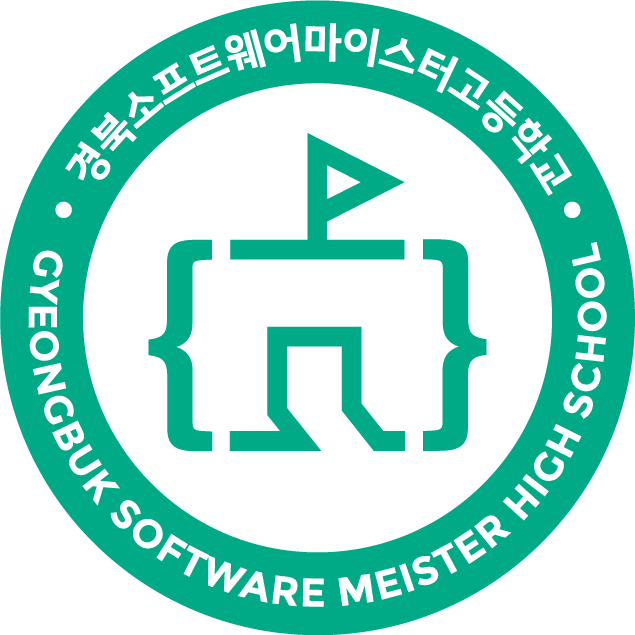
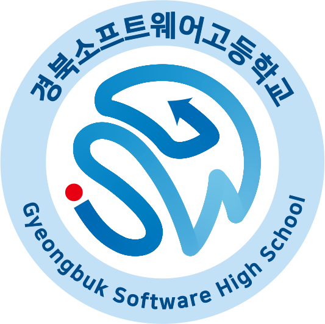
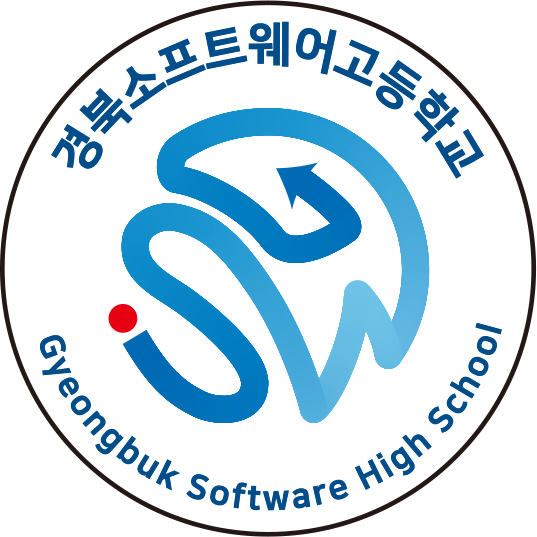
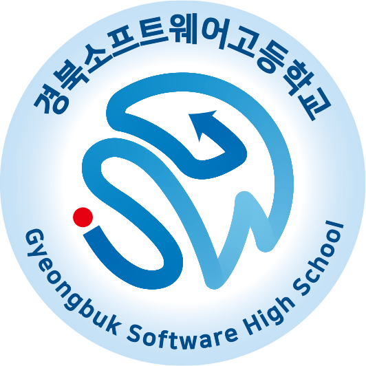
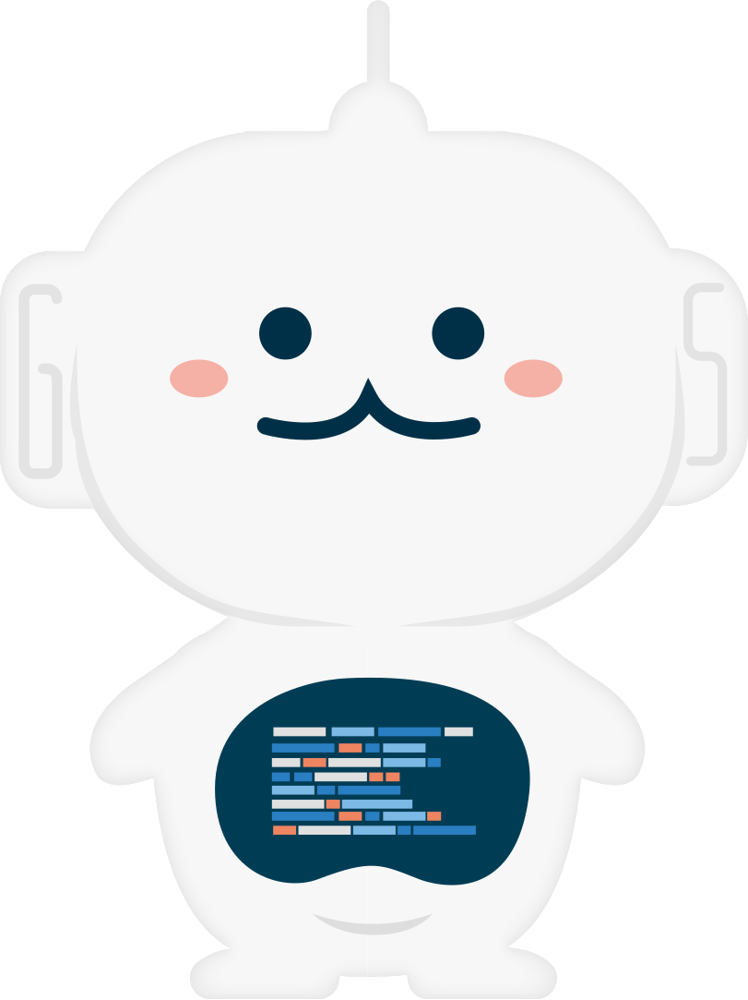
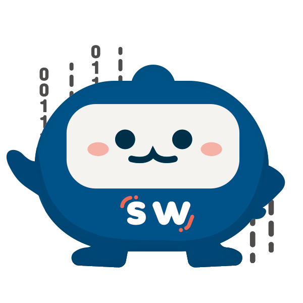
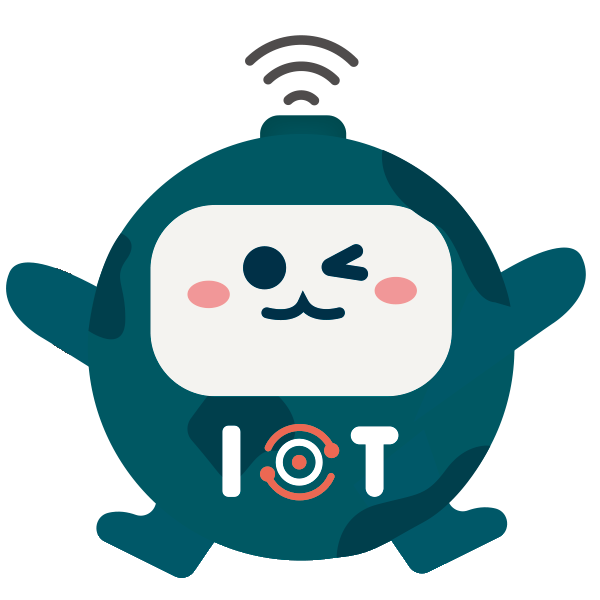

# GBSWHS/CI-Signature
경북소프트웨어고등학교 / 경북소프트웨어마이스터고 CI및 캐릭터

## License
이 레포지트에 업로드 된 모든 사진 및 구성 파일의 저작권은
`경북소프트웨어고등학교, 경북소프트웨어마이스터고`와 그 원작자에게 있습니다.

이 레포지트에 업로드 된 모든 사진 및 구성 파일을 사용할 경우
정당한 저작권자에게 허락을 구하여야 합니다.

## Colors
|   | hex | rgb | cmyk |
| - | --- | --- | ---- |
|  | `#00AA87` | `rgb(0,170,135)` | `cmyk(67,0,14,33)` |
|  | `#B4DAF3` | `rgb(180,218,243)` | `cmyk(27,4,0,0)` |
|  | `#65C2E4` | `rgb(101,194,228)` | `cmyk(55,5,5,0)` |
|  | `#00A2D6` | `rgb(0,162,214)` | `cmyk(75,18,3,0)` |
|  | `#0071B6` | `rgb(0,113,182)` | `cmyk(100,50,3,0)` |
|  | `#004E82` | `rgb(0,78,130)` | `cmyk(100,50,3,36)` |
|  | `#ED1C24` | `rgb(237,28,36)` | `cmyk(0,100,100,0)` |

## Symbol Marks
|  |  |  |  |  |
|:---:|:---:|:---:|:---:|:---:|
| `symbol-new-solid.png` | `symbol-solid` | `symbol-simple` | `symbol-gradient` | `symbol-logo` |

## Characters
|  |  |  |  |  |
|:---:|:---:|:---:|:---:|:---:|
| 소원이 (`sowon`) | 소코 (**so**ftware **co**ding, `soco`) | 아코 (**A**I **co**ding, `a-co`) | 구) 아코 (**I**OT **co**ding, `i-co`) | 엔코 (**en**joy **co**ding, `enco`) | 
| 학교 캐릭터 | 소프트웨어개발과 캐릭터 | 인공지능소프트웨어과 캐릭터 | 사물인터넷과 캐릭터 | 게임개발과 캐릭터 |
